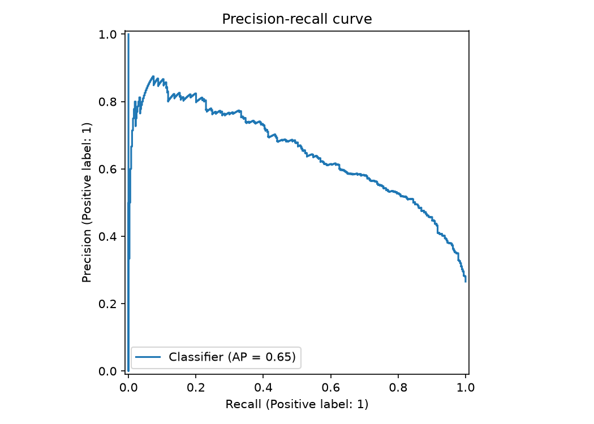
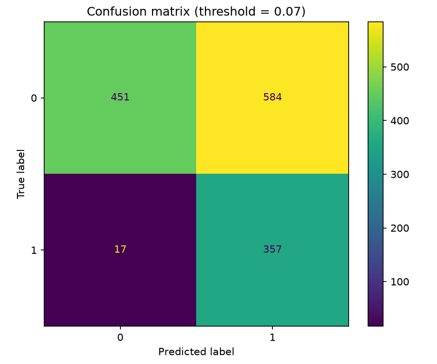
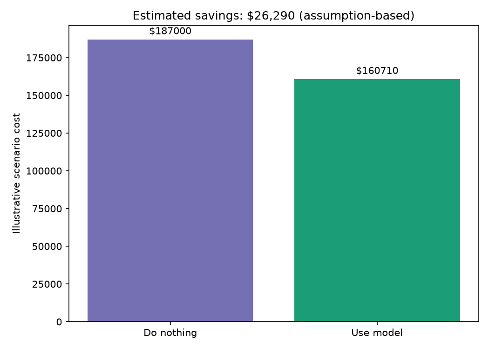
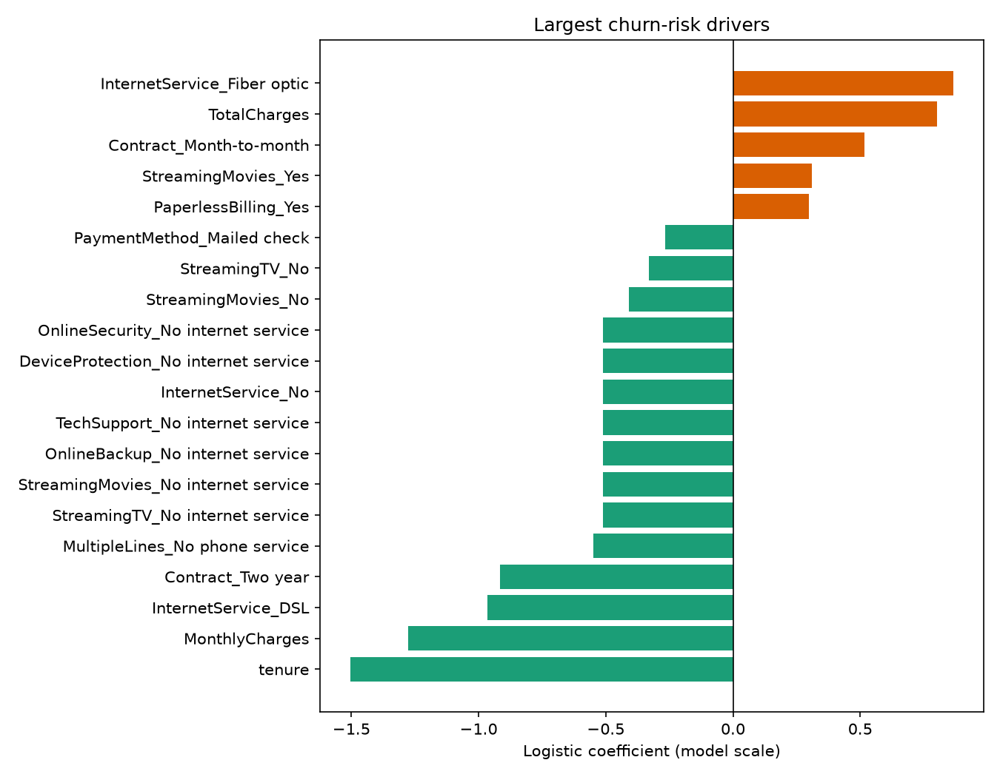
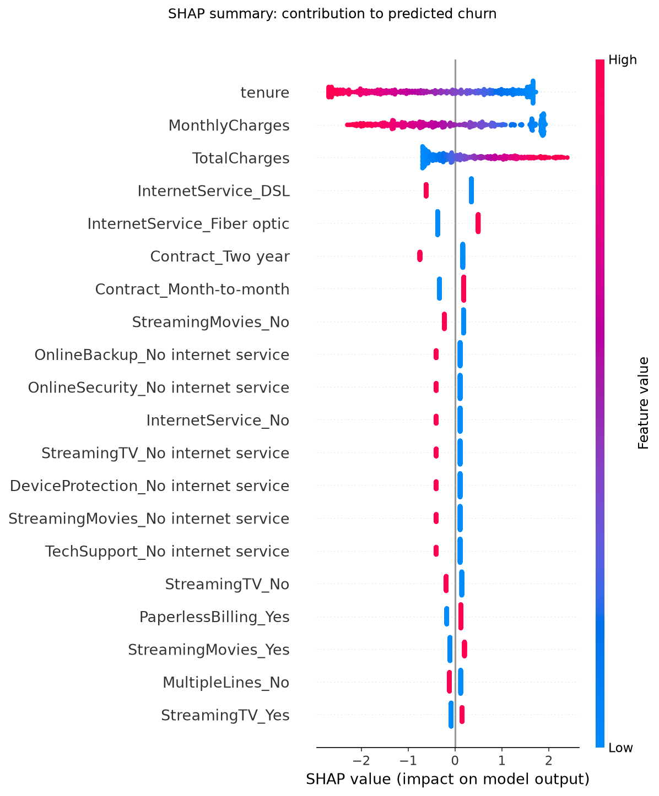

# Telco Customer Churn

An end-to-end tabular classification project that predicts whether a fictional
telecommunications customer will churn. The implementation covers validated
data loading, leakage-safe preprocessing, model comparison, hyperparameter
tuning, business-aware threshold selection, explainability, holdout evaluation,
generated reports, and automated tests.

> **Status:** End-to-end training and decision-analysis workflow implemented.

## Problem

Customer retention teams cannot contact every subscriber. A churn model can
rank customers by risk so that limited retention resources are directed toward
the people most likely to leave.

- **Target:** `Churn` (`Yes` or `No`)
- **Prediction unit:** one customer
- **False negative:** a likely churner is missed
- **False positive:** a retention offer is spent on a customer who would stay

The data describes a fictional company. Financial impact must therefore be
presented as a scenario based on assumptions, not as observed business savings.

## Data

The project uses IBM's **Telco Customer Churn** sample:

- 7,043 customers
- 20 candidate predictors plus the `Churn` target
- Demographics, subscribed services, contract details, tenure, and charges

The download script retrieves the CSV from IBM, checks its columns and row
count, and saves it under `data/raw/`. The raw file is intentionally excluded
from Git. See [data/README.md](data/README.md) for source details and data notes.

## Method

1. Validate required columns, target values, and unique customer IDs.
2. Convert `TotalCharges` to numeric, preserving blanks as missing values.
3. Remove `customerID` and map the target to `0` and `1`.
4. Create a reproducible 80/20 stratified train/test split.
5. Keep imputation, scaling, and one-hot encoding inside each model pipeline to
   prevent preprocessing leakage.
6. Compare a dummy baseline, logistic regression, random forest, and histogram
   gradient boosting with five-fold stratified cross-validation.
7. Tune logistic regression inside each outer fold and generate nested
   out-of-fold (OOF) probabilities.
8. Select a business threshold using only those OOF training predictions.
9. Refit on all training data and evaluate the frozen model and threshold once
   on the untouched holdout set.
10. Report logistic coefficients, SHAP values, segment performance, and
    assumption-based campaign economics.

PR-AUC is the primary selection metric because churn is the minority class.
ROC-AUC, Brier score, threshold metrics, calibration, and the confusion matrix
provide complementary views of model quality.

## Results

Logistic regression was the strongest candidate:

- Logistic regression: CV PR-AUC `0.657 ± 0.034`, ROC-AUC `0.846 ± 0.015`
- Histogram gradient boosting: CV PR-AUC `0.641 ± 0.032`
- Random forest: CV PR-AUC `0.620 ± 0.033`
- Dummy baseline: CV PR-AUC `0.265`

Grid search selected `C=10` with no class weighting. Nested OOF predictions
selected a threshold of `0.070` under the documented campaign assumptions. On
the 1,409-customer holdout set, the frozen threshold achieved:

- PR-AUC: `0.650`
- ROC-AUC: `0.844`
- Brier score: `0.135`
- Accuracy: `0.573`
- Precision: `0.379`
- Recall: `0.955`
- F1: `0.543`
- Confusion matrix: 451 true negatives, 584 false positives, 17 false
  negatives, and 357 true positives

The low threshold is intentional: under this scenario, missing a customer who
could have been retained is substantially more expensive than making an
unnecessary contact. Accuracy falls, while recall rises from `0.529` at the
default threshold to `0.955`.

## Business scenario

The business analysis uses illustrative—not observed—assumptions:

- Retention contact: `$10` per targeted customer
- Customer value lost to churn: `$500`
- Successful retention among contacted churners: `20%`

On the holdout sample, doing nothing has an assumed churn cost of `$187,000`.
The model targets 941 customers and has an estimated scenario cost of
`$160,710`, producing `$26,290` in estimated savings. Changing the assumed
retention success rate to 10%, 20%, and 30% changes estimated savings to
`$8,440`, `$26,290`, and `$44,140`, respectively.

These are decision-scenario estimates, not claimed company savings. The sample
is fictional and contains no randomized retention-treatment outcomes.







## Explainability and segment checks

Coefficient and SHAP reports agree that tenure, monthly charges, total charges,
internet service, and contract type are influential. Longer tenure and
two-year contracts are associated with lower predicted churn, while fiber
service and month-to-month contracts are associated with higher predicted
churn. These are model associations, not causal effects.

At the selected threshold, recall is `0.997` for month-to-month customers but
`0.364` for two-year-contract customers. The generated metrics also break
performance down by internet-service type, making aggregate results easier to
audit.





Additional ROC and calibration plots are available under `reports/figures/`.

## Reproduce the project

From the repository root, install the project and development dependencies:

```bash
uv sync --extra dev
```

Download and validate the dataset:

```bash
uv run python projects/telco-churn/scripts/download_data.py
```

Run model comparison, tuning, final training, and holdout evaluation:

```bash
uv run python projects/telco-churn/src/train.py
```

The training command writes:

- `models/best_model.joblib`
- `reports/metrics/cv_results.json`
- `reports/metrics/metrics.json`
- `reports/metrics/threshold_selection.json`
- ROC, precision-recall, calibration, and confusion-matrix figures
- Business-impact, logistic-coefficient, and SHAP figures

The dataset, fitted model, and generated metric JSON files are ignored by Git.
The report figures are retained for presentation.

## Run the tests

Run the complete repository test suite:

```bash
uv run pytest
```

Run only this project's tests:

```bash
uv run pytest projects/telco-churn/tests
```

The tests use small synthetic fixtures so they remain fast, deterministic,
offline, and independent of the ignored raw CSV. They cover data conversion,
duplicate-ID validation, feature/target separation, reproducible stratified
splitting, a full pipeline fit/predict smoke test, business-cost calculations,
threshold optimization, sensitivity analysis, and segment metrics.

Run the quality checks with:

```bash
uv run ruff check .
uv run ruff format --check .
```

## Structure

```text
telco-churn/
├── data/                  # Dataset documentation and ignored raw CSV
├── notebooks/             # Notebook guidance
├── reports/
│   ├── figures/           # Generated evaluation plots
│   └── metrics/           # Ignored generated metric files
├── scripts/
│   └── download_data.py   # Download and source validation
├── src/
│   ├── business.py        # Threshold selection and scenario economics
│   ├── data.py            # Loading, validation, and splitting
│   ├── evaluate.py        # Metrics, explanations, and report figures
│   ├── pipeline.py        # Preprocessing and model pipelines
│   └── train.py           # Comparison, tuning, training, and evaluation
└── tests/                 # Project-local tests using synthetic fixtures
```

## Limitations and next steps

- The dataset is a public fictional sample, not current production data.
- Business impact depends on assumed customer value, contact cost, and
  intervention effectiveness; none are observed in this dataset.
- Performance may change under population or service-offering drift.
- SHAP values and coefficients explain model behavior, not causal effects.
- A production iteration should validate assumptions through controlled
  retention experiments, add drift monitoring, and expose batch or API
  inference.
